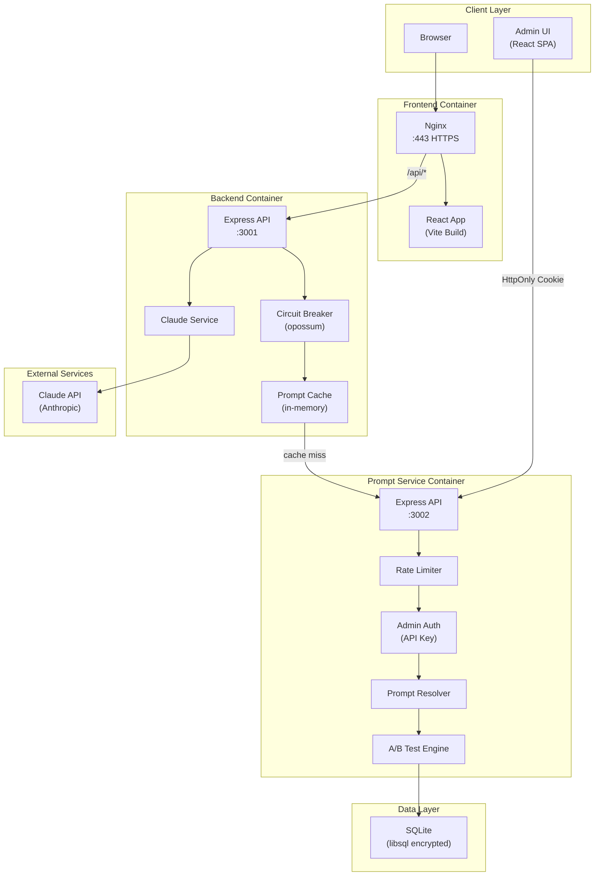
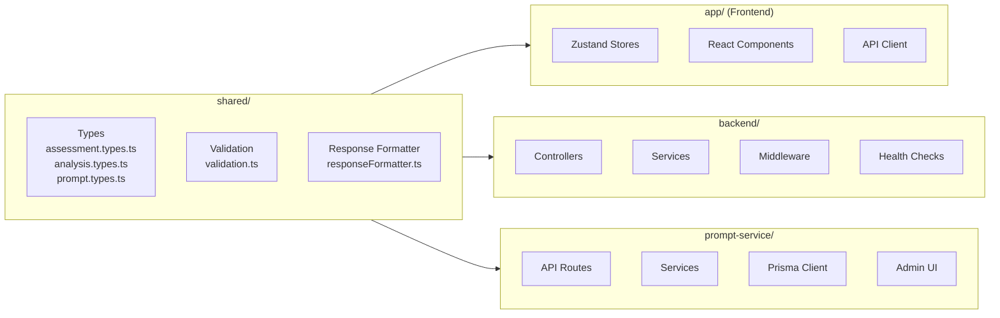
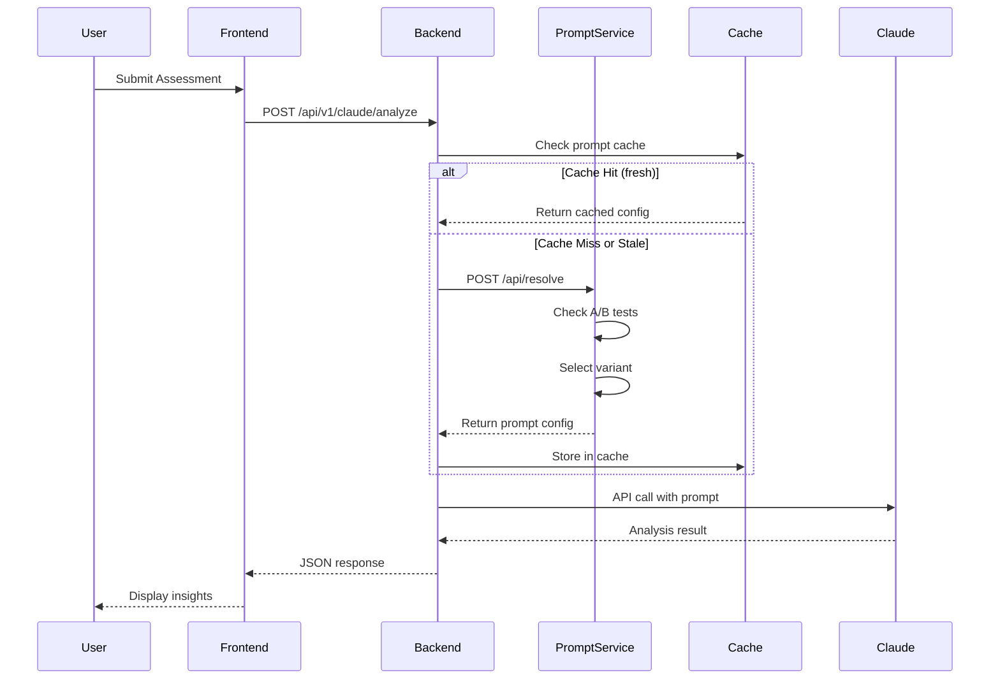
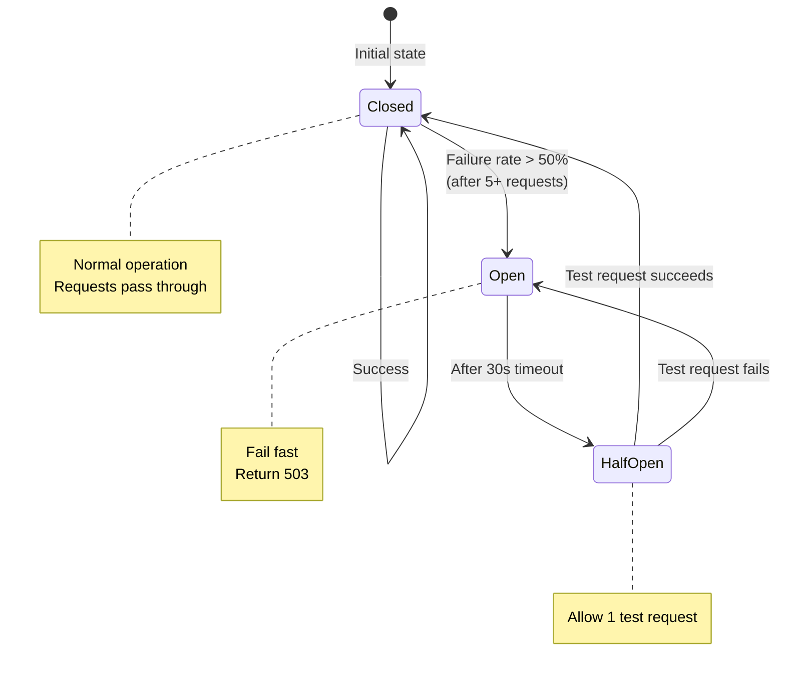
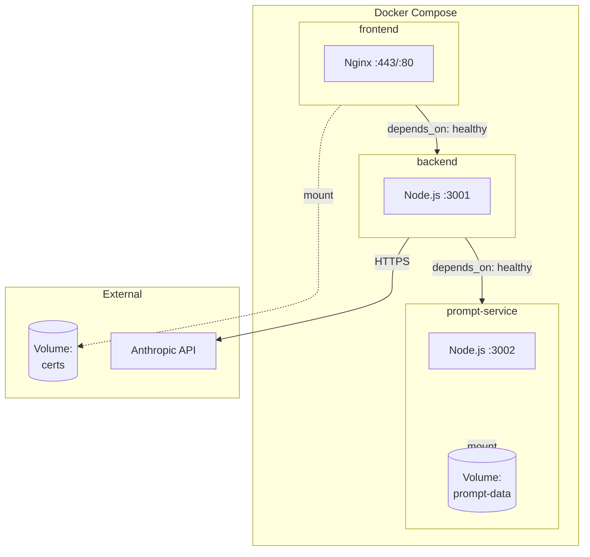
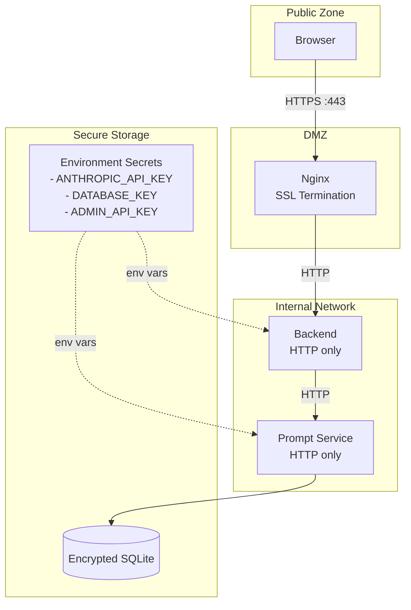
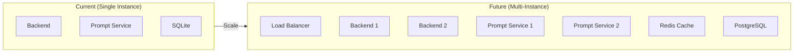

# Votive Architecture

## Overview

Votive is a behavioral psychology assessment application with AI-powered analysis. The system follows a microservices architecture with clear separation of concerns between frontend, backend API proxy, and prompt management.

## Architecture Diagram



## Component Architecture



## Request Flow

### Analysis Request Flow



### Circuit Breaker States



## Design Decisions

### 1. Microservices Architecture

**Decision**: Separate prompt management into its own microservice.

**Rationale**:
- **IP Protection**: Prompts contain proprietary business logic and can be stored in an encrypted database rather than source code
- **Independent Scaling**: Prompt service can be scaled separately from the main backend
- **A/B Testing**: Centralized prompt management enables experimentation without code changes
- **Hot Updates**: Prompts can be modified via admin UI without redeployment

### 2. Circuit Breaker Pattern

**Decision**: Use opossum circuit breaker for prompt-service calls.

**Rationale**:
- **Fail Fast**: When prompt-service is unavailable, fail immediately (503) rather than waiting
- **Automatic Recovery**: Circuit transitions to half-open after 30s, allowing recovery
- **Cache Integration**: Stale cache entries can trigger background refresh when circuit closes
- **Graceful Shutdown**: `destroyAllCircuitBreakers()` function removes event listeners to prevent memory leaks

**Configuration**:
| Parameter | Value | Purpose |
|-----------|-------|---------|
| timeout | 5000ms | Max wait time per request |
| errorThresholdPercentage | 50% | Failure rate to open circuit |
| resetTimeout | 30000ms | Time before retry attempt |
| volumeThreshold | 5 | Min requests before calculating error rate |

### 3. In-Memory Caching with Stale-While-Revalidate

**Decision**: Cache prompt configs in memory with TTL-based freshness.

**Rationale**:
- **Performance**: Avoid HTTP calls for every analysis request
- **Resilience**: Serve stale data while refreshing in background
- **Simplicity**: No external cache infrastructure required

**TTL Configuration**:
| TTL | Duration | Behavior |
|-----|----------|----------|
| CACHE_TTL_MS | 5 minutes | Fresh - serve immediately |
| STALE_TTL_MS | 1 hour | Stale - serve while refreshing |
| > STALE_TTL_MS | - | Expired - delete entry |

**Resilience**: When prompt-service is unavailable but stale cached data exists, the system returns stale data instead of failing. A background refresh is scheduled to update the cache when the service recovers.

**Cache Key Format**: `JSON.stringify({ key, thinkingEnabled })` (uses JSON serialization to prevent collisions if keys contain special characters).

**Concurrent Refresh Limiting**: Background refresh operations are limited to `MAX_CONCURRENT_REFRESHES = 3` to prevent memory leaks. Excess refresh requests are queued and processed sequentially as active refreshes complete.

**Note**: Cache is per-process. In multi-instance deployments, each instance maintains its own cache.

### 4. Timing-Safe Authentication with HttpOnly Cookies

**Decision**: Use HttpOnly session cookies as primary authentication with `crypto.timingSafeEqual` for API key validation.

**Rationale**:
- **XSS Protection**: HttpOnly cookies cannot be accessed by JavaScript, mitigating XSS attacks
- **Timing Attack Prevention**: Uses `crypto.timingSafeEqual` for secret comparison
- **Best Practice**: Standard approach for secure session management

**Authentication Flow**:
1. Admin UI calls `/api/auth/login` with API key
2. Server validates key with timing-safe comparison
3. Server sets signed HttpOnly cookie (Secure, SameSite=Strict)
4. Subsequent requests authenticated via cookie
5. X-Admin-Key header supported for backward compatibility

### 5. Rate Limiting

**Decision**: Apply rate limiting to admin endpoints only.

**Rationale**:
- **Admin Protection**: Prevent brute-force attacks on API key
- **Backend Unaffected**: `/api/resolve` endpoint used by backend is not rate-limited
- **Reasonable Limits**: 100 requests per 15 minutes is sufficient for admin operations

### 6. SQLite with libsql Encryption

**Decision**: Use SQLite with libsql adapter for database encryption.

**Rationale**:
- **Simplicity**: No external database server required
- **Portability**: Database file can be backed up and moved easily
- **Security**: AES encryption at rest protects prompt content
- **Performance**: SQLite is fast for read-heavy workloads

### 7. Health Check Architecture

**Decision**: Non-critical health check for prompt-service.

**Rationale**:
- **Graceful Degradation**: Backend can start even if prompt-service is temporarily unavailable
- **Circuit Breaker Integration**: Health check reflects circuit breaker state
- **Dependency Visibility**: Operators can see prompt-service status in health endpoint

## Container Architecture



### Container Health Checks

All containers use Node.js fetch for health checks (wget not available in Alpine):

```yaml
healthcheck:
  test: ["CMD", "node", "-e", "fetch('http://localhost:PORT/health').then(r => process.exit(r.ok ? 0 : 1)).catch(() => process.exit(1))"]
  interval: 30s
  timeout: 10s
  retries: 3
  start_period: 10s
```

## Security Architecture



### Security Measures

| Layer | Measure | Implementation |
|-------|---------|----------------|
| Transport | HTTPS | Nginx SSL termination |
| API | Rate Limiting | express-rate-limit on admin endpoints |
| Authentication | HttpOnly Cookie + API Key | Signed HttpOnly session cookie (primary) or X-Admin-Key header (fallback) |
| Data at Rest | Encryption | libsql AES encryption |
| Headers | Security Headers | Helmet with CSP directives (script-src, style-src, img-src, connect-src) |
| CORS | Origin Restriction | Whitelist of allowed origins |
| Input Validation | XSS Prevention | Prompt content sanitized for script tags, event handlers, and javascript: URLs |
| Error Handling | Type-Safe Errors | AppError hierarchy (NotFoundError, ValidationError, ConflictError) with status codes |

## Environment Configuration

For complete environment variable reference, see [Production Deployment Guide](production-deployment.md#environment-variables).

## Monitoring & Observability

### Health Endpoints

| Endpoint | Service | Purpose |
|----------|---------|---------|
| GET /health | Backend | Overall health + dependencies |
| GET /health | Prompt Service | Service health |

### Health Response Structure

```json
{
  "status": "healthy",
  "timestamp": "2024-01-01T00:00:00.000Z",
  "checks": {
    "anthropic": { "status": "healthy" },
    "prompt-service": { "status": "healthy" }
  }
}
```

## Future Considerations

### Planned Enhancements

1. **Multi-Language Support**: Add language column to prompts for i18n
2. **OpenTelemetry**: Distributed tracing and metrics
3. **Redis Cache**: Shared cache for multi-instance deployments
4. **Kubernetes**: Container orchestration for production

### Scalability Path


